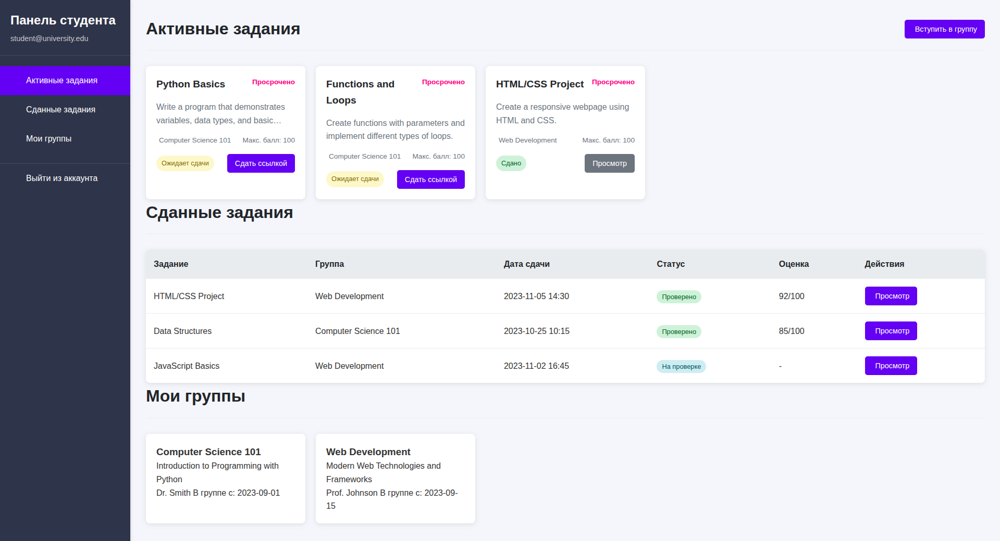
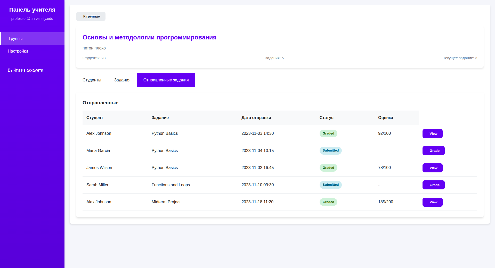

# SomeTask

Веб-приложение для автоматизации сбора и проверки домашних заданий с ролями Студент и Преподаватель.





## Технологии

Backend:

- Python + FastAPI
- PostgreSQL (основная база данных)

Frontend:

- Javascript
- HTML + CSS

Инфраструктура:

- Docker + Docker Compose
- Nginx (обратный прокси)
- GitHub Actions (CI/CD)

## Функциональные требования

### Роли и доступы

Студент:

- Присоединение к курсам по пригласительным ссылкам
- Просмотр заданий с дедлайнами и статусами
- Загрузка решений (PDF, DOC, ZIP, изображения - до 50 МБ/файл)
- Просмотр оценок и обратной связи
- Таблица личных результатов и рейтинг в группе

Преподаватель:

- Создание и управление курсами/группами
- Генерация пригласительных ссылок
- Создание заданий с дедлайнами и критериями оценки
- Проверка работ с предпросмотром файлов
- Выставление оценок с комментариями и файлами правок
- Возврат работ на доработку
- Аналитика и экспорт результатов (CSV/XLSX)

### Основные статусы работ

- Не отправлено → Отправлено → Проверено
- Отправлено → На доработке → Отправлено (повторно) → Проверено

### Бизнес-правила

- Одна первичная отправка до дедлайна
- Одна повторная отправка при статусе "На доработке"
- Оценка не превышает максимальный балл задания
- Безопасное хранилище файлов с проверкой прав доступа

## API

REST API с JWT аутентификацией. Основные endpoints:

- /auth/* - регистрация, вход, выход
- /courses/* - управление курсами
- /homeworks/* - задания и отправки
- /submissions/* - проверка работ
- /analytics/* - отчеты и статистика

Полная спецификация: [openapi.yaml](openapi.yaml)

## Разработка

```bash
# Запуск в development режиме
docker-compose up -d

# Установка зависимостей
npm install  # frontend
pip install -r requirements.txt  # backend"
```
